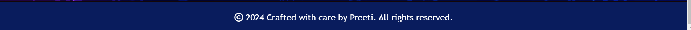
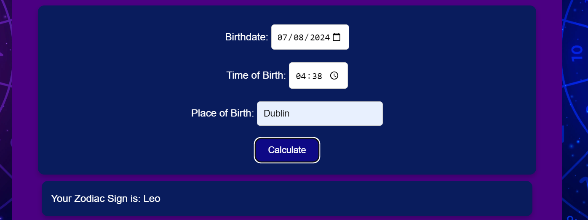
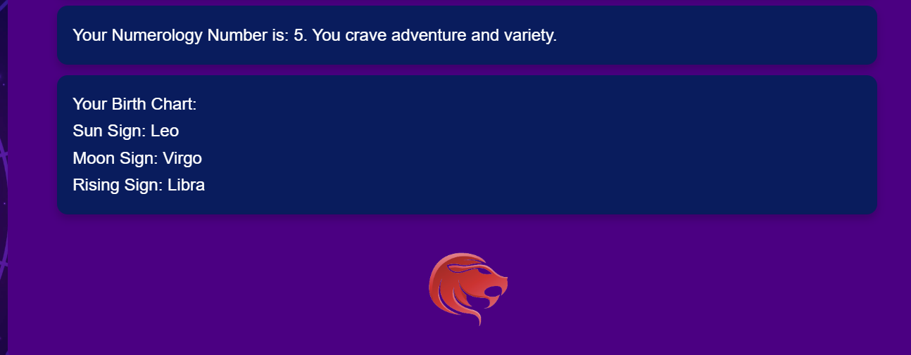
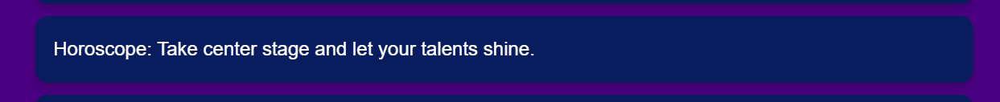
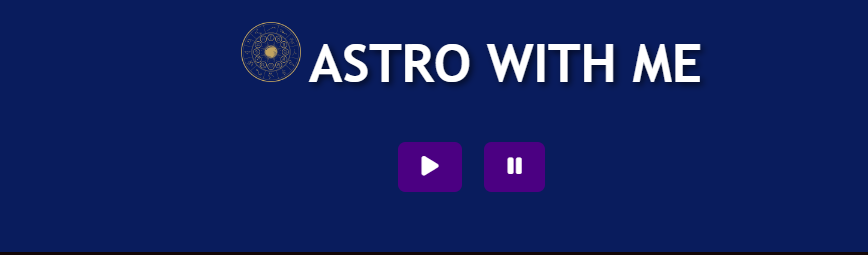
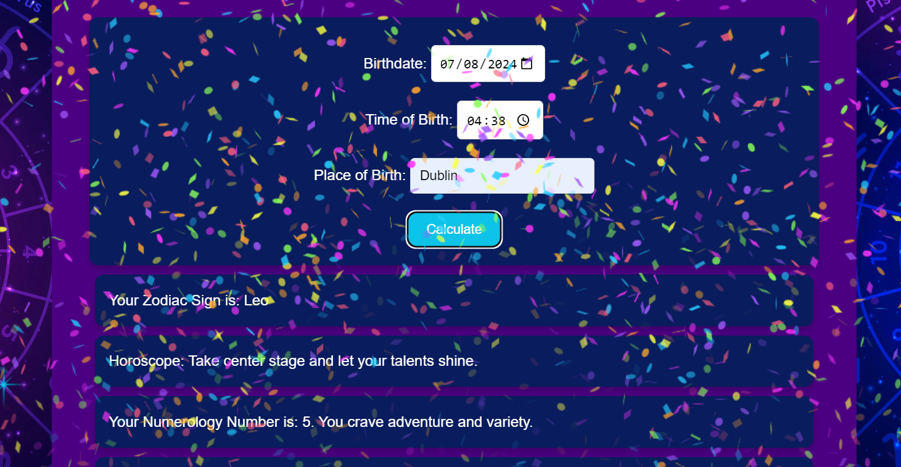

## Welcome to Astro with Me! 

## **Site Overview**
This page is dedicated to dedicated to astrology, likely offering users information about their zodiac signs, numerology, and possibly a personalized birth chart based on user input. The page include interactive quizzes, data collection forms, and dynamic content based on user input.

***
***(By Preeti Singh)***

## [Link to Live Website](https://preeticancode.github.io/astro-with-me/)

## Table of contents:
1. [**Site Overview**](#site-overview)
2. [**Planning stage**](#planning-stage)
    * [***Target Audiences***](#target-audiences)
    * [***User Stories***](#user-stories)
    * [***Site Aims***](#site-aims)
    * [***Wireframes***](#wireframes)
    * [***Color Scheme***](#color-scheme)
3. [**Features**](#features)
    * [**Header**](#Header)
    * [**Footer**](#footer)
    * [**Typography**](#typography)
4. [**Key features**](#page-content-features)
    * [**Zodiac Sign Calculation**](#zodiac-sign-calculation)
    * [**Numerology and Birth Chart**](#numerology-and-birth-chart)
    * [**Horoscope**](#horoscope)
    * [**Music Player**](#music-player)
    * [**Confetti Animation**](#confetti-animation)
    * [**Interactive Quiz**](#interactive-quiz)
5. [**Future-Enhancements**](#future-enhancements)
6. [**Testing Phase**](#testing-phase)
7. [**Deployment**](#deployment)
8. [**Forking the GitHub Repository**](#forking-the-gitHub-repository)
9. [**Local Clone**](#local-clone)
10. [**Credits**](#credits)
    * [**Frameworks, Libraries & Programs Used**](#Frameworks-Libraries-&-Programs-Used)
    * [**Content**](#content)
    * [**Media**](#media)
    * [**Honorable mentions**](#honorable-mentions)
    * [**References**](#references)

## **Planning stage**
### **Target Audiences:**
1. *Astrology Enthusiasts*: Individuals who have a keen interest in astrology and regularly seek    out horoscopes, zodiac information, and astrological advice.
2. *Self-Improvement Seekers*: People who use astrology as a tool for personal growth and self-understanding. They may look for ways to better understand their personality, relationships, and life paths.
3. *Newcomers to Astrology*: Individuals who are new to astrology and looking for an introduction or a simple way to explore their astrological profile.
4. *Casual Users*: Users who have a casual interest in astrology and may use the page for fun or entertainment purposes.
5. *People Seeking Personalized Insights*: Users who are looking for personalized readings and interpretations based on their specific birthdate and time.
6. *Users Interested in Interactive Experiences*: People who enjoy interactive and immersive online experiences, including quizzes and dynamic content.
7. *Fans of Aesthetic Design*: Users who appreciate well-designed web pages with aesthetically pleasing visuals that align with the theme of astrology.

### **User Stories:**
1. *Personal Astrological Insights*
As a: User interested in astrology
I want to: Enter my birthdate and time
So that: I can receive personalized zodiac, numerology, and horoscope information

2. *View Zodiac Sign Information*
As a: User who has entered my birth details
I want to: See my zodiac sign and a corresponding image
So that: I can better understand my astrological profile

3. *Receive Horoscope*
As a: User interested in daily insights
I want to: Read a horoscope based on my zodiac sign
So that: I can gain daily guidance or inspiration

4. *Understand Numerology*
As a: User curious about numerology
I want to: Learn my numerology number and its meaning
So that: I can understand its significance in my life

5. *Explore Birth Chart*
As a: User who has entered detailed birth information
I want to: See a simplified birth chart with sun, moon, and rising signs
So that: I can get a basic understanding of my astrological influences

6. *Participate in a Quiz*
As a: User who enjoys interactive content
I want to: Take a quiz related to my personality
So that: I can discover more about myself in an engaging way

7. *View Quiz Results*
As a: User who has completed the quiz
I want to: See my quiz results and personality insights
So that: I can reflect on the results and how they relate to me

8. *Return to Name Entry*
As a: User who wants to restart the quiz
I want to: Go back to the name entry screen
So that: I can take the quiz again or make changes

9. *Control Background Music*
As a: User who enjoys background music
I want to: Play or pause the background music
So that: I can control my browsing experience

10. *Set Birthdate Limit*
As a: User entering birthdate
I want to: Ensure my birthdate is within a valid range
So that: I avoid errors and receive accurate results

### **Site Aims:**
1. *Provide Personalized Astrological Insights*: To offer users customized information about their zodiac sign, numerology, and birth chart based on their specific birthdate and time.

2. *Engage Users with Interactive Content*: To include interactive features like quizzes that allow users to explore their personality traits in an engaging manner.

3. *Deliver Accurate and Relevant Information*: To ensure that the astrological data, horoscopes, and numerology readings provided are accurate and relevant.

4. *Create an Enjoyable User Experience*: To design the site with a user-friendly interface, clear navigation, and aesthetically pleasing visuals.

5. *Support Personal Reflection and Growth*: To offer tools and insights that encourage users to reflect on their personal traits, tendencies, and life paths.

6. *Enable Customization and Control*: To provide features such as background music controls and quiz customization options.

7. *Promote Education and Awareness*: To educate users about astrology and numerology through accessible and engaging content.

8. *Facilitate Easy Navigation and Accessibility*: To ensure that all features and content are easily accessible and navigable for all users.

### **Wireframes:**
To organize my thoughts and prevent scope creep, I created wireframes for this project. Below are links to each of the mobile and desktop versions of the four intended pages. 

* Wireframes:
    * [Main Page](docs/wireframes/index.png)
   
  There was some deviation from the original wireframes to improve the User Experience (UX).

### **Color Scheme:**
When deciding the color scheme, I wanted to go with something that gave an elegant appearance. For this reason, I selected a range of blue and gold's and used the following color grid created on [https://contrast-grid.eightshapes.com/](https://contrast-grid.eightshapes.com/?version=1.1.0&background-colors=&foreground-colors=%23f0f8ff%20(Alice%20Blue)%0D%0A%234b0082%20(Indigo)%0D%0A%23091c5d%20(Dark%20Blue)%0D%0A%23091c5d%20(Dark%20Blue)%0D%0A%234b0082%20(Indigo)%0D%0A%23000000%20(Black)%0D%0A%23ffffff%20(White)%0D%0A%23000000%20(Black)%0D%0Argba(0%2C%200%2C%200%2C%200.6)%20and%20rgba(0%2C%200%2C%200%2C%200.4)%20(Black%20with%20varying%20opacity)%0D%0A%0D%0A&es-color-form__tile-size=compact&es-color-form__show-contrast=aaa&es-color-form__show-contrast=aa&es-color-form__show-contrast=aa18&es-color-form__show-contrast=dnp) to check the contrast scores. Using this grid allowed me to ensure all text remained visible and the site was accessible to all.

## **Features**

## **Header**
1. Title and Logo: The page title "Astro With Me" is accompanied by a logo image that visually represents the brand.
2. Music Controls: Icons for play and pause allow users to control background music directly from the header.

## **Footer**
1. Copyright Notice: A message indicating that the site was "Crafted with care by Preeti, 2024," with all rights reserved.
2. Contact Link: There is an option to contact you, presumably via email or another method.
3. Dynamic Year: The year updates automatically, ensuring the footer stays current without manual updates.

## **Typography**
1. Primary Font Family for Most Text:
Font Family: 'Arial', sans-serif.
2. Headings and Important Text:
Font Family: 'Trebuchet MS', 'Lucida Sans Unicode', 'Lucida Grande', 'Lucida Sans', Arial, sans-serif.

Note: The choice of fonts aims to balance readability with aesthetic appeal, ensuring that the text remains clear and visually engaging across different devices and screen sizes.All fonts were sourced from Google fonts, as stated in the credits.

## **Key features**
### **Zodiac Sign Calculation:**
* User Input: Users can input their birthdate, birth time, and birth location.
* Zodiac Sign Display: The site calculates and displays the user's zodiac sign based on the inputted birthdate.

### **Numerology and Birth Chart:**
* Numerology: The site provides numerology details based on the user’s name and birthdate.
* Birth Chart: Although not visible in detail, there is a section to display the birth chart, which is likely calculated using the inputted birth information.

### **Horoscope:**
* Daily Horoscope: There is a feature to display daily horoscopes for users, based on their zodiac sign.

### **Music Player**
* Background Music: There is a feature that allows users to play and pause background music. This can enhance the ambiance while browsing the site.
* Music Controls: Simple play and pause controls are provided at the top of the page.

### **Confetti Animation**
* Celebratory Animation: There is an embedded script for confetti animations, which could be triggered upon submiting form.

### **Interactive Quiz**
* Name Entry: Users are prompted to enter their name to start the quiz.
* Quiz Questions: After starting the quiz, users can answer questions that seem related to astrology or personality traits.
* Quiz Results: The quiz results are displayed after submission, providing users with insights or outcomes based on their answers.

## **Future-Enhancements**
1. Personalized Daily/Weekly Horoscopes
User Accounts: Implement a user registration and login system so users can save their birth details and get personalized horoscopes.
Personalized Content: Provide personalized daily, weekly, and monthly horoscopes based on saved birth details.

2. Interactive Birth Chart
Visual Birth Charts: Generate and display detailed birth charts with explanations for various astrological houses and aspects.
User Input: Allow users to enter their birth details and see an interactive birth chart.

3. Astrology Blog
Educational Articles: Regularly publish articles about astrology, zodiac signs, planetary transits, etc.
User Interaction: Allow users to comment on articles and engage in discussions.

4. Compatibility Analysis
Zodiac Compatibility: Provide tools for users to check their compatibility with others based on zodiac signs.
Numerology Compatibility: Include numerology compatibility analysis.

5. Astrology Tools and Calculators
Numerology Calculator: Provide tools for calculating life path numbers, destiny numbers, etc.
Astrology Calculators: Include moon sign, rising sign calculators, etc.

6. Consultation Services
Booking System: Implement a booking system for astrology consultations.
Consultation Types: Offer different types of consultations such as love, career, and personal growth readings.

7. Community Features
Forums: Create a forum for users to discuss astrology topics.
Groups: Allow users to form interest-based groups.

8. Enhanced User Interface and Experience
Dark Mode: Add a dark mode option for user comfort.
Responsive Design: Ensure the site is fully responsive and looks good on all devices, especially mobile.

9. Mobile App
App Development: Develop a mobile app to provide easy access to horoscopes, articles, and other features.
Push Notifications: Send daily horoscopes and updates via push notifications.

10. E-commerce Integration
Astrology Reports: Sell detailed astrology reports.
Astrology Merchandise: Offer merchandise like zodiac-themed jewelry, books, etc.

11. Astrology Courses and Webinars
Online Courses: Offer online courses on astrology basics, advanced techniques, etc.
Live Webinars: Host live webinars with astrology experts.

12. Multilingual Support
Multiple Languages: Provide content in multiple languages to cater to a global audience.
***

## **Testing Phase**
I have included details of testing both during development and post development in a separate document called [TESTING.md](TESTING.md).
***

## **Deployment**
The site was deployed to GitHub pages. The steps taken to deploy are as follows:
1. Log in to [Github](https://github.com/)
2. Navigate to [preeticancode/astro-with-me](https://github.com/preeticancode/astro-with-me) in  
   the list of repositories
3. In the GitHub repository, navigate to the [Settings] tab
4. In Settings scroll down to [GitHub pages] which opens in a new page.
5. From the source section drop-down menu, select the Master Branch
6. Once the master branch has been selected, the page is automatically refreshed and a display indicates the successful deployment and the link to the address.

The link to the live website is here:
https://preeticancode.github.io/astro-with-me/

## **Forking the GitHub Repository**
By forking the repository, we make a copy of the original repository on our GitHub account to view and change without affecting the original repository by using these steps:

1. Log in to GitHub and locate [GitHub Repository capital-cities](https://github.com/preeticancode/astro-with-me)
2. At the top of the Repository(under the main navigation) locate "Fork" button.
3. Now you should have a copy of the original repository in your GitHub account.

## **Local Clone**
1. Log in to GitHub and locate [GitHub Repository capital-cities](https://github.com/preeticancode/astro-with-me)
2. Under the repository name click "Clone or download"
3. Click on the code button, select clone with HTTPS, SSH or GitHub CLI and copy the link shown.
4. Open Git Bash
5. Change the current working directory to the location where you want the cloned directory to be made.
6. Type `git clone` and then paste The URL copied in the step 3.
7. Press Enter and your local clone will be created.
***

## **Credits**
### **Frameworks, Libraries & Programs Used**
Balsamiq - Used to create wireframes.

Git - For version control.

Gitpod - To work on website as workspace.

Github - To save and store the files for the website.

Google Fonts - To import the fonts used on the website.

Font Awesome - For the iconography on the website.

Google Dev Tools - To troubleshoot and test features, solve issues with responsiveness and 
    styling.

Tiny PNG To compress images.

Convertio To convert images to webp format.

Redketchup to resize image.

Favicon.io To create favicon.

Am I Responsive? To show the website image on a range of devices.

### **Content**
All content was written by myself and fewtext for the Home page was taken google article.

The icons in the footer were taken from [Font Awesome](https://fontawesome.com/)

Accessibility checker - [WAVE - Web accessibility evaluation tool](https://wave.webaim.org/)

The Confetti is taken from [JSDelivr](https://www.jsdelivr.com/)

The animated cursor is taken from [Free Cursors](https://totallyfreecursors.com/)

Background Music: Sourced from [chosic](https://www.chosic.com/)
  

### **Media**
The photos used on the background is from [Freepik](https://www.freepik.com/).

The some images used for the gallery page were taken from open source site (pixabay).

Screenshot under README.md section titled "site overview" was created view [Am I responsive](http://ami.responsivedesign.is)

Color grid contract tool - [Eightshapes](https://contrast-grid.eightshapes.com/) 

### **Honorable mentions**
I would like to take the opportunity to thank:
- My mentor Mitko Bachvarov for his feedback, advice, guidance and support. Also David Bowers for helping.
- My husband Rajesh for his support, advice, help with testing, and for giving me some kids free 
  time to work on my project.
- To the lovely people on the Code Institute Slack for providing peer code reviews.
***

### **References**
Code institute Learning Materials

Code Institute Walkthrough projec: Love Maths
***

