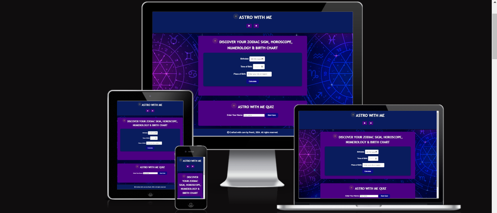
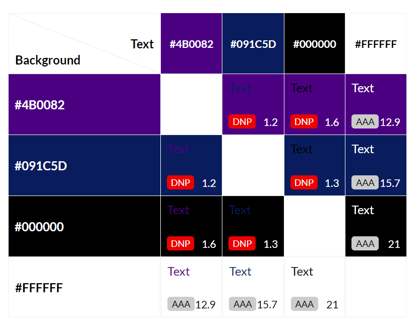

## Welcome to Astro with Me! 

## **Site Overview**
This page is dedicated to dedicated to astrology, likely offering users information about their zodiac signs, numerology, and possibly a personalized birth chart based on user input. The page include interactive quizzes, data collection forms, and dynamic content based on user input.

***
***(By Preeti Singh)***

## [Link to Live Website](https://preeticancode.github.io/preeti-project2/)

## Table of contents:
1. [**Site Overview**](#site-overview)
2. [**Planning stage**](#planning-stage)
    * [***Target Audiences***](#target-audiences)
    * [***User Stories***](#user-stories)
    * [***Site Aims***](#site-aims)
    * [***Wireframes***](#wireframes)
    * [***Color Scheme***](#color-scheme)
3. [**Features**](#features)
    * [**Footer**](#footer)
    * [**Typography**](#typography)
4. [**Key features**](#page-content-features)
    * [**Zodiac Sign Calculation**](#zodiac-sign-calculation)
    * [**Numerology and Birth Chart**](#numerology-and-birth-chart)
    * [**Horoscope**](#horoscope)
    * [**Music Player**](#music-player)
    * [**Confetti Animation**](#confetti-animation)
5. [**Future-Enhancements**](#future-enhancements)
6. [**Testing Phase**](#testing-phase)
7. [**Deployment**](#deployment)
8. [**Credits**](#credits)
    * [**Frameworks, Libraries & Programs Used**](#Frameworks-Libraries-&-Programs-Used)
    * [**Content**](#content)
    * [**Media**](#media)
    * [**Honorable mentions**](#honorable-mentions)
    * [**References**](#references)

## **Planning stage**
### **Target Audiences:**
1. *Astrology Enthusiasts*: Individuals who have a keen interest in astrology and regularly seek    out horoscopes, zodiac information, and astrological advice.
2. *Self-Improvement Seekers*: People who use astrology as a tool for personal growth and self-understanding. They may look for ways to better understand their personality, relationships, and life paths.
3. *Newcomers to Astrology*: Individuals who are new to astrology and looking for an introduction or a simple way to explore their astrological profile.
4. *Casual Users*: Users who have a casual interest in astrology and may use the page for fun or entertainment purposes.
5. *People Seeking Personalized Insights*: Users who are looking for personalized readings and interpretations based on their specific birthdate and time.
6. *Users Interested in Interactive Experiences*: People who enjoy interactive and immersive online experiences, including quizzes and dynamic content.
7. *Fans of Aesthetic Design*: Users who appreciate well-designed web pages with aesthetically pleasing visuals that align with the theme of astrology.

### **User Stories:**
1. *Personal Astrological Insights*
As a: User interested in astrology
I want to: Enter my birthdate and time
So that: I can receive personalized zodiac, numerology, and horoscope information

2. *View Zodiac Sign Information*
As a: User who has entered my birth details
I want to: See my zodiac sign and a corresponding image
So that: I can better understand my astrological profile

3. *Receive Horoscope*
As a: User interested in daily insights
I want to: Read a horoscope based on my zodiac sign
So that: I can gain daily guidance or inspiration

4. *Understand Numerology*
As a: User curious about numerology
I want to: Learn my numerology number and its meaning
So that: I can understand its significance in my life

5. *Explore Birth Chart*
As a: User who has entered detailed birth information
I want to: See a simplified birth chart with sun, moon, and rising signs
So that: I can get a basic understanding of my astrological influences

6. *Participate in a Quiz*
As a: User who enjoys interactive content
I want to: Take a quiz related to my personality
So that: I can discover more about myself in an engaging way

7. *View Quiz Results*
As a: User who has completed the quiz
I want to: See my quiz results and personality insights
So that: I can reflect on the results and how they relate to me

8. *Return to Name Entry*
As a: User who wants to restart the quiz
I want to: Go back to the name entry screen
So that: I can take the quiz again or make changes

9. *Control Background Music*
As a: User who enjoys background music
I want to: Play or pause the background music
So that: I can control my browsing experience

10. *Set Birthdate Limit*
As a: User entering birthdate
I want to: Ensure my birthdate is within a valid range
So that: I avoid errors and receive accurate results

### **Site Aims:**
1. *Provide Personalized Astrological Insights*: To offer users customized information about their zodiac sign, numerology, and birth chart based on their specific birthdate and time.

2. *Engage Users with Interactive Content*: To include interactive features like quizzes that allow users to explore their personality traits in an engaging manner.

3. *Deliver Accurate and Relevant Information*: To ensure that the astrological data, horoscopes, and numerology readings provided are accurate and relevant.

4. *Create an Enjoyable User Experience*: To design the site with a user-friendly interface, clear navigation, and aesthetically pleasing visuals.

5. *Support Personal Reflection and Growth*: To offer tools and insights that encourage users to reflect on their personal traits, tendencies, and life paths.

6. *Enable Customization and Control*: To provide features such as background music controls and quiz customization options.

7. *Promote Education and Awareness*: To educate users about astrology and numerology through accessible and engaging content.

8. *Facilitate Easy Navigation and Accessibility*: To ensure that all features and content are easily accessible and navigable for all users.

### **Wireframes:**
To organize my thoughts and prevent scope creep, I created wireframes for this project. Below are links to each of the mobile and desktop versions of the four intended pages. 

* Wireframes:
    * [Main Page](docs/wireframes/index.png)
   
  There was some deviation from the original wireframes to improve the User Experience (UX).

### **Color Scheme:**
When deciding the color scheme, I wanted to go with something that gave an elegant appearance. For this reason, I selected a range of blue and gold's and used the following color grid created on [https://contrast-grid.eightshapes.com/](https://contrast-grid.eightshapes.com/?version=1.1.0&background-colors=&foreground-colors=%23f0f8ff%20(Alice%20Blue)%0D%0A%234b0082%20(Indigo)%0D%0A%23091c5d%20(Dark%20Blue)%0D%0A%23091c5d%20(Dark%20Blue)%0D%0A%234b0082%20(Indigo)%0D%0A%23000000%20(Black)%0D%0A%23ffffff%20(White)%0D%0A%23000000%20(Black)%0D%0Argba(0%2C%200%2C%200%2C%200.6)%20and%20rgba(0%2C%200%2C%200%2C%200.4)%20(Black%20with%20varying%20opacity)%0D%0A%0D%0A&es-color-form__tile-size=compact&es-color-form__show-contrast=aaa&es-color-form__show-contrast=aa&es-color-form__show-contrast=aa18&es-color-form__show-contrast=dnp) to check the contrast scores. Using this grid allowed me to ensure all text remained visible and the site was accessible to all.

## **Features**

## **Typography**
* 1. Primary Font Family for Most Text:
Font Family: 'Arial', sans-serif
* 2. Headings and Important Text:
Font Family: 'Trebuchet MS', 'Lucida Sans Unicode', 'Lucida Grande', 'Lucida Sans', Arial, sans-serif
* The choice of fonts aims to balance readability with aesthetic appeal, ensuring that the text remains clear and visually engaging across different devices and screen sizes.
* All fonts were sourced from Google fonts, as stated in the credits.

