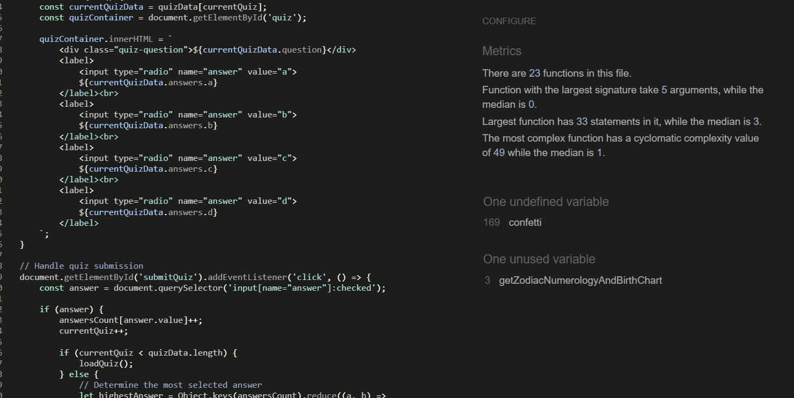
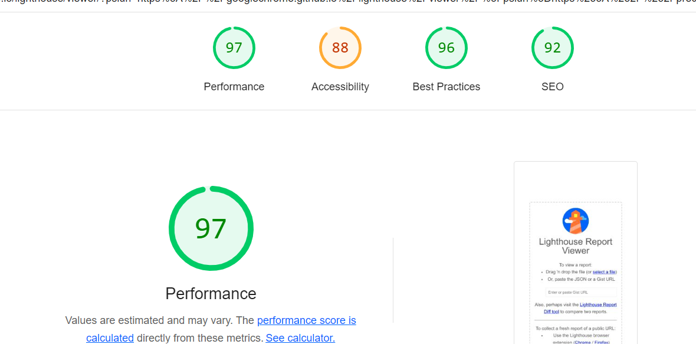
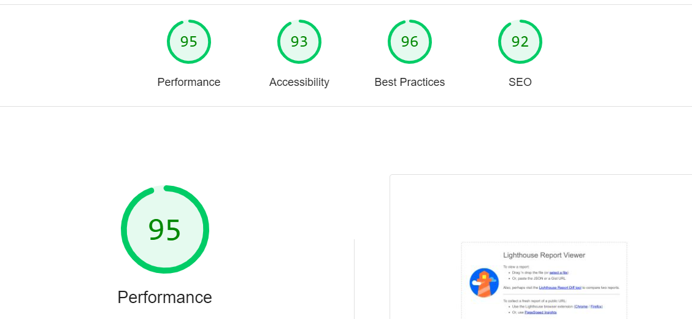

# Testing Page Table of Contents
* [**During Development Testing**](#during-development-testing)
    * [*Manual Testing*](#manual-testing)
    * [*Bugs and Fixes*](#bugs-and-fixes)
* [**Post Development Testing**](#post-development-testing)
  * [**Validators**](#validators)
      * [*HTML*](#html---httpsvalidatorw3orgnu)
      * [*CSS*](#css---httpsjigsaww3orgcss-validator)
      * [*JS*](#JS---https://jshint.com)
  * [**Lighthouse Scores**](#lighthouse-scores)
      * [*Mobile Version*](#mobile-version)
      * [*Desktop Version:*](#desktop-version)
  * [**Accessability**](#accessability)
  * [**Unfixed Bug**](#unfixed-bug)

## **During Development Testing**
During the development process, I was manually testing in the following ways:-

1. Manually testing each element for appearance and responsiveness,I used Chrome developer tools extensively during development to troubleshoot issues.
    
2. Published the page via GitHub pages and shared with fellow students to test and received feedback.

### ***Manual Testing:***
* During testing, I used four different browsers to ensure cross-compatibility. The desktop browsers used by myself were:

  1. Chrome
  2. Firefox  
  3. Opera
  4. Edge

* I then used the devtools to simulate different screen sizes/devices from 320 px up to 4000px in width. 
* In addition to this, I also asked several people to test using iPhones and Apple Mac laptops/desktops using safari. These users reported no issues or bugs only style suggestions.

### ***Bugs and Fixes:***

Below is a list of bugs I found during the development process by testing myself via the live server extension on VSCode. I tried each element for how the browser would display the page to potential users on a range of different screen widths from 320px to 4000px:-

1. **Intended Outcome** - Page should be responsive.
    * ***Issue Found:*** 
        * Container was not properly aligned. noticed your container gets cropped from the right side. 
    * ***Solution Used:*** 
        * Added media query.
2. **Intended Outcome** - There should be no contrats error.
    * ***Issue Found:*** 
        * I was getting contrast error with heading. 
    * ***Solution Used:***    
        * I changed the backgroung image and color.

3. **Intended Outcome** - Music control should not be auto played
    * ***Issue Found:*** 
        It was autoplaying.
    * ***Solution Used***:
        Removed the Auto-Play Call, backgroundMusic.play() is not called automatically in any part of your code that runs on page load.

4. **Intended Outcome** No Image should overlap.
    * ***Issue Found:*** 
        Bottom container image was overlapping with footer.
    * ***Solution Used:*** 
        Changed the footer in CSS from fixed to absolute.
    
5. **Intended Outcome** - Play music button should be visible.
    * ***Issue Found:*** 
        Play music button was at bottom and that was imacting vibvisibility and use of it.
    * ***Solution Used:***
        * I mmoved music control along with headers.
6. **Intended Outcome** - limit future date selection in your birthdate.
    * ***Issue Found:***
        * Future date was getting selected.
    * ***Solution Used:***
        * This function gets today's date and formats it as YYYY-MM-DD, which is required for the max attribute. I set this value as the maximum selectable date for the birthdate input field.
    
## **Post Development Testing**
### **Validators**

#### ***HTML*** - https://validator.w3.org/nu/

* ***Issue Found:***
   I had missed some closing tags.
* ***Solution Used:***
    It helped in checking my HTML .

#### ***CSS*** - https://jigsaw.w3.org/css-validator/

* All pages tested, no issues found via URL or file upload.\

#### ***JS*** - https://jshint.com//
 
Thereis no undefinec and unused One undefined variable
169	confetti
One unused variable

### **Lighthouse Scores**
### **Test conditions**
* I did all lighthouse tests in incognito mode to avoid interference from browser extensions. 
* I ran the tests for both mobile and desktop. 
* I asked people to run lighthouse tests from their own devices. 
#### ***Mobile Version:***
 ***[index.html:](https://preeticancode.github.io/astro-with-me/)***
     

#### ***Desktop Version:***
 ***index.html:***
     

  
### **Accessability**
In addition to the accessability score on light house I also used [WAVE - Web accessability evaluation tool](https://wave.webaim.org/) to check my pages for accessability and no errors were returned.
***   

### **Unfixed bugs**
Changed the name gihub repository name from project two to Astro-with-me
***

[return to README.md](README.md)